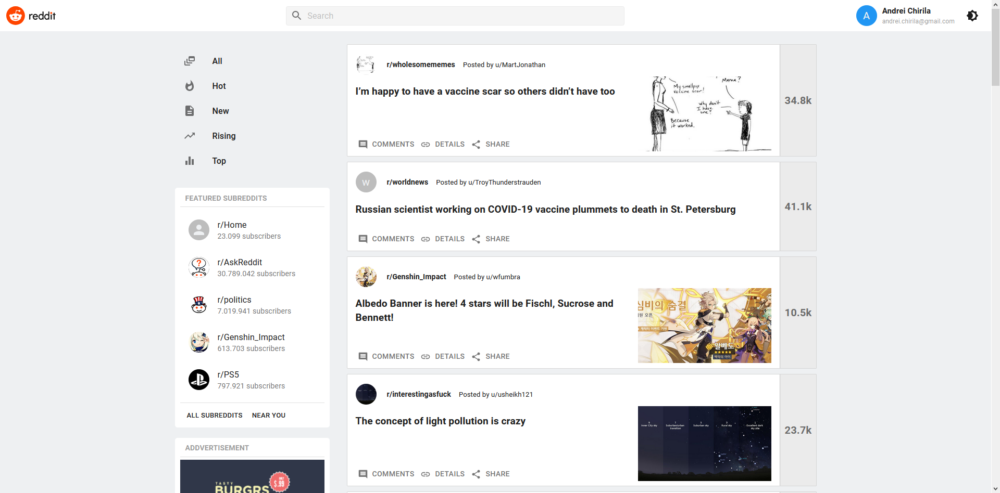

<div align="center">

[](https://github.com/Kerosz/reddit-client)

### Modern, compact & simple

</div>

This is the main repo codebase of
[Reddit Client](https://github.com/Kerosz/reddit-client). Every single line of
code is in this repository.

## Table of contents

- [Table of contents](#table-of-contents)
- [Introduction](#introduction)
  - [Vision](#vision)
- [Codebase](#codebase)
  - [Technologies](#technologies)
  - [Folder structure](#folder-structure)
  - [Code Style](#code-style)
- [Setup Process](#setup-process)
- [Acknowledgments](#acknowledgments)

## Introduction

[](https://github.com/Kerosz/reddit-client/issues)
[](https://github.com/Kerosz/reddit-client)
[]()

### Vision

It is difficult to change and adapt to different trends and designs as a company
that impact millions of users. Users need modern changes that improves the
usability and experience of their favorite online applications.

**Reddit Client Redesign is the unofficial [Reddit](https://www.reddit.com/)
frontend app concept to simplify and tune the browsing experience of the users**

## Codebase

### Technologies

Almost the entire codebase consists in **Javascript**

Here is a list of technologies used:

- **React**: Front-end library
- **Redux**: Global state management
- **Jest & React Testing Library**: Testing suite

### Folder structure

```sh
reddit-client/
├── public     # Public files used on the frontend
└── src        # Frontend SPA

reddit-client/src
├── components     # Reusabble parts
├── features       # Redux slices
├── helpers        # Utilify functions
├── hooks          # Custom hooks
├── pages          # Application views
├── store          # Redux store configuration
└── theme          # Material UI theme configuration
```

### Code Style

Running `Prettier` on-commit, which means you can write code in whatever style
you want and it will be automatically formatted according to the common style
when you run `git commit`.

## Setup Process

- Clone or download the repo
- Open the directory and run `yarn` to install
- Run development application by using `yarn start`

## Acknowledgments

The project is using
[Reddit JSON Api](https://github.com/reddit-archive/reddit/wiki/JSON) to get the
data from [Reddit](https://www.reddit.com/)

The project was a task given by [Codecademy](https://www.codecademy.com) being a
part of their full-stack engineer course path. The goal of the project was to
showcase all previews skills and technologies learned until this point on the
path (HTML / CSS, JavaScript, React, Redux, Jest, Enzyme and Selenium, Git and
Github Projects, Command line, Wireframes)
